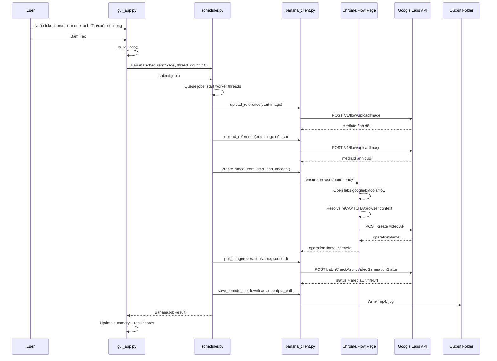
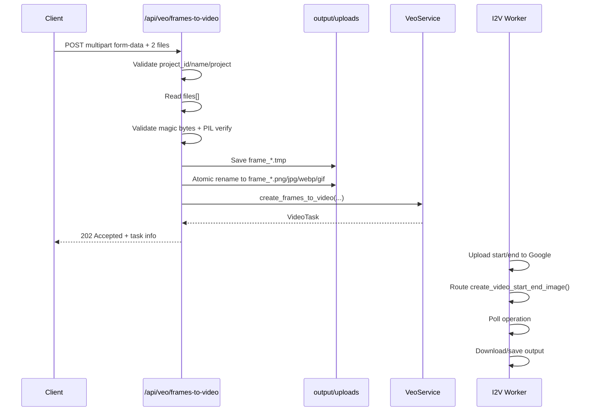

# Luồng chạy Banana/Veo reference implementation

Tài liệu này mô tả luồng chạy của bản `tool_veo3_mau` từ lúc nhận input ở UI, tạo job, mở Chrome browser runtime, gọi API Google Labs, poll kết quả và lưu file đầu ra.

## 1. Các file chính

| File | Vai trò |
|---|---|
| `gui_app.py` | Giao diện Tkinter, nhận input, tạo danh sách job, hiển thị log/kết quả |
| `scheduler.py` | Chia job theo lane/thread, retry, route image/video/start-end, poll và lưu file |
| `banana_client.py` | Quản lý Chrome/Playwright runtime, upload ảnh, gọi API tạo ảnh/video, poll, download |
| `browser_scripts.py` | JavaScript chạy trong Labs page để gọi API kèm reCAPTCHA/browser context |
| `gui_settings.json` | Lưu cấu hình UI: token, thư mục lưu, số luồng, mode, ảnh đầu/cuối |

---

## 2. Input từ UI

Người dùng nhập/cấu hình trong app:

1. `Access Token`
   - Mỗi token một dòng.
   - Scheduler sẽ chia lane theo round-robin trên danh sách token.

2. `Mode`
   - `image`: tạo ảnh.
   - `video`: tạo video từ ảnh đầu, hoặc ảnh đầu + ảnh cuối.

3. `Model`
   - Với `image`: `GEM_PIX_2` hoặc `NARWHAL`.
   - Với `video`: UI ép model thành `VIDEO_I2V`.

4. `Tỷ lệ`
   - Image: `16:9`, `9:16`, `1:1`.
   - Video: `16:9`, `9:16`.

5. `Số luồng`
   - Mặc định fallback là `10`.
   - Khi chạy, scheduler tạo tối đa `thread_count` worker.

6. `Ảnh đầu / tham chiếu`
   - Bắt buộc nếu mode là `video`.
   - Tuỳ chọn nếu mode là `image`.

7. `Ảnh kết thúc`
   - Chỉ dùng khi mode là `video`.
   - Nếu có ảnh cuối, route sẽ chuyển sang start/end video.

8. `Prompt(s)`
   - Mỗi dòng là một job.
   - Dòng trống bị bỏ qua.

9. `Thư mục lưu`
   - Mỗi job sinh file output riêng.
   - Image lưu dạng `banana_1.jpg`, `banana_2.jpg`, ...
   - Video lưu dạng `banana_1.mp4`, `banana_2.mp4`, ...

---

## 3. Tạo job từ UI

Khi bấm nút `Tạo`, UI gọi `_start_generation()`.

Luồng chính:

```python
tokens, jobs, save_dir = self._build_jobs()
```

Trong `_build_jobs()`:

1. Đọc tokens từ tab Cài đặt.
2. Đọc prompts, mỗi dòng thành một job.
3. Đọc mode/model/aspect/thread.
4. Đọc `reference_path` và `end_reference_path`.
5. Nếu mode là `video` mà không có ảnh đầu thì báo lỗi.
6. Nếu mode không phải `video`, bỏ qua ảnh cuối.
7. Tạo danh sách `BananaJob`.

Một job có dạng:

```python
BananaJob(
    mode='video',
    prompt='<prompt>',
    model='VIDEO_I2V',
    aspect_ratio='16:9',
    reference_path='<ảnh đầu>',
    end_reference_path='<ảnh cuối hoặc None>',
    output_path='<save_dir>/banana_1.mp4',
)
```

Sau đó UI tạo thread nền để chạy scheduler:

```python
scheduler = BananaScheduler(
    tokens=tokens,
    thread_count=int(self.thread_count_var.get().strip() or '1'),
    max_attempts=5,
)
results = scheduler.submit(jobs)
```

---

## 4. Scheduler khởi tạo lane/thread

Trong `BananaScheduler.__init__()`:

1. Làm sạch danh sách token.
2. Xác định thư mục runtime:

```python
run_dir = Path(sys.executable).resolve().parent if getattr(sys, 'frozen', False) else Path(__file__).resolve().parent
self.base_dir = run_dir / '.runtime'
```

Nếu chạy exe thì `.runtime` nằm cạnh exe.

3. Tạo profile Chrome shared:

```python
self.shared_profile_dir = self.base_dir / 'profile_shared'
```

4. Tạo một `BananaImageClient` dùng chung:

```python
self.shared_client = BananaImageClient(
    logger=lambda message: logging.info(message),
    lane_id='shared',
    user_data_dir=str(self.shared_profile_dir),
)
```

5. Tạo danh sách lane theo số luồng:

```python
self.lanes = [
    BananaLane(
        lane_id=f'lane-{index + 1}',
        access_token=cleaned_tokens[index % len(cleaned_tokens)],
    )
    for index in range(self.thread_count)
]
```

Nếu có 10 luồng và 3 token:

```text
lane-1  -> token 1
lane-2  -> token 2
lane-3  -> token 3
lane-4  -> token 1
lane-5  -> token 2
...
```

---

## 5. Queue job và chạy worker

Trong `submit(jobs)`:

1. Gán `batch_index` và `batch_total` cho từng job.
2. Log từng job khi đưa vào queue:

```text
batch=queue index=1/20 job=<uuid> mode=video model=VIDEO_I2V aspect=16:9 has_start=True has_end=True output=...
```

3. Tạo worker thread:

```python
actual_worker_count = min(self.thread_count, len(jobs))
```

4. Mỗi worker lấy job từ queue và gọi:

```python
result = self._run_job_on_lane(job, lane)
```

---

## 6. Mở Chrome browser runtime

Chrome không mở ngay khi scheduler khởi tạo. Chrome được mở lazy khi lần đầu cần gọi API qua browser.

Trong `banana_client.py`, `FlowBrowser.evaluate_create_image()` gọi:

```python
return self._run_coro(self._evaluate_create_image_internal_async(config))
```

Nếu thread browser chưa chạy, `_ensure_thread()` tạo thread riêng:

```python
self._thread = threading.Thread(
    target=self._browser_thread_main,
    name=f'FlowBrowser-{self.lane_id}',
    daemon=True,
)
```

Trong thread đó tạo event loop asyncio riêng.

Khi cần page, `_ensure_internal_async()` chạy:

1. Tìm Chrome:

```python
C:\Program Files\Google\Chrome\Application\chrome.exe
C:\Program Files (x86)\Google\Chrome\Application\chrome.exe
%USERPROFILE%\AppData\Local\Google\Chrome\Application\chrome.exe
```

2. Tạo thư mục profile nếu chưa có.

3. Start Playwright:

```python
self._pw = await async_playwright().start()
```

4. Spawn Chrome bằng subprocess:

```python
chrome.exe
--remote-debugging-port=<random 9222-10222>
--user-data-dir=<.runtime/profile_shared>
--window-position=-32000,-32000
--window-size=1280,720
--start-minimized
--disable-blink-features=AutomationControlled
--no-sandbox
--no-first-run
--no-default-browser-check
--new-window
https://labs.google/fx/tools/flow
```

5. Chờ CDP endpoint:

```text
http://127.0.0.1:<port>/json/version
```

6. Connect Playwright vào Chrome qua CDP:

```python
self._browser = await self._pw.chromium.connect_over_cdp(ws_endpoint)
```

7. Lấy page đầu tiên hoặc tạo page mới.

8. Điều hướng tới:

```text
https://labs.google/fx/tools/flow
```

9. Chờ reCAPTCHA sẵn sàng bằng JS `RECAPTCHA_READY_JS`.

Khi thành công log dạng:

```text
[Browser:shared] Spawned Chrome PID: ... on port ...
[Flow:shared] Ready at: https://labs.google/fx/tools/flow
```

---

## 7. Vì sao phải mở browser?

Các API tạo ảnh/video cần browser context của Google Labs:

- Origin/Referer hợp lệ.
- reCAPTCHA token/action hợp lệ.
- Context page đang ở Labs Flow.

Tool không gọi API create trực tiếp bằng `requests`. Nó inject JS vào page Labs đang mở:

```python
result = self.browser.evaluate_create_image(config)
```

Trong đó `config` gồm:

```python
{
    'siteKey': SITE_KEY,
    'action': 'VIDEO_GENERATION' hoặc 'IMAGE_GENERATION',
    'apiUrl': '<endpoint tạo ảnh/video>',
    'method': 'POST',
    'payloadJson': json.dumps(payload),
    'bearerToken': access_token,
}
```

`browser_scripts.py` sẽ dùng page context để resolve reCAPTCHA rồi fetch API.

---

## 8. Upload ảnh đầu/cuối

Trong `_run_job_on_lane()`:

Nếu có `reference_path`, upload ảnh đầu:

```python
start_media_id = self.shared_client.upload_reference(
    lane.access_token,
    job.reference_path,
)
```

Nếu có `end_reference_path`, upload ảnh cuối:

```python
end_media_id = self.shared_client.upload_reference(
    lane.access_token,
    job.end_reference_path,
)
```

Upload dùng endpoint:

```text
https://aisandbox-pa.googleapis.com/v1/flow/uploadImage
```

Request body:

```json
{
  "clientContext": {
    "projectId": "c4ac3a92-d3c7-46b3-97ea-0bf5f51aeb1d",
    "tool": "PINHOLE"
  },
  "fileName": "image.jpg",
  "imageBytes": "<base64>",
  "isHidden": false,
  "isUserUploaded": true,
  "mimeType": "image/jpeg"
}
```

Header:

```http
Authorization: Bearer <access_token>
Content-Type: text/plain;charset=UTF-8
Accept: */*
Origin: https://labs.google
Referer: https://labs.google/
```

Response được parse để lấy `mediaId` theo nhiều khả năng:

```python
media_id = (
    data.get('mediaId')
    or (data.get('media') or {}).get('mediaId')
    or data.get('name')
    or (data.get('media') or {}).get('name')
    or data.get('id')
    or data.get('mediaGenerationId')
)
```

Log upload:

```text
stage=upload start_reference=<path>
stage=upload-done kind=start media_id=<id>
stage=upload end_reference=<path>
stage=upload-done kind=end media_id=<id>
```

---

## 9. Route xử lý theo mode

Sau khi upload ảnh, scheduler route như sau:

```python
if job.mode == 'video':
    if not media_ids:
        raise BananaClientError('Video mode requires one start/reference image')

    if len(media_ids) >= 2:
        created = self.shared_client.create_video_from_start_end_images(...)
    else:
        created = self.shared_client.create_video_from_image(...)
else:
    created = self.shared_client.create_image(...)
```

### Bảng route

| Điều kiện | Hàm gọi | Ý nghĩa |
|---|---|---|
| `mode=image`, không ảnh | `create_image()` | Text to image |
| `mode=image`, có ảnh đầu | `create_image(media_ids=[...])` | Image reference to image |
| `mode=video`, chỉ ảnh đầu | `create_video_from_image()` | Video từ ảnh đầu |
| `mode=video`, ảnh đầu + ảnh cuối | `create_video_from_start_end_images()` | Video start/end frame |

---

## 10. Tạo video từ một ảnh đầu

Hàm:

```python
create_video_from_image(access_token, prompt, media_id, aspect_ratio)
```

Aspect mapping:

```python
api_aspect = 'VIDEO_ASPECT_RATIO_PORTRAIT' if aspect_ratio == '9:16' else 'VIDEO_ASPECT_RATIO_LANDSCAPE'
```

Model key:

```python
video_model_key = get_video_model_key(aspect_ratio, tier='PAYGATE_TIER_TWO', model_speed='relaxed')
```

Endpoint:

```text
https://aisandbox-pa.googleapis.com/v1/video:batchAsyncGenerateVideoStartImage
```

Payload chính:

```json
{
  "clientContext": {
    "projectId": "c4ac3a92-d3c7-46b3-97ea-0bf5f51aeb1d",
    "tool": "PINHOLE",
    "userPaygateTier": "PAYGATE_TIER_TWO",
    "sessionId": ";<timestamp_ms>"
  },
  "requests": [
    {
      "aspectRatio": "VIDEO_ASPECT_RATIO_LANDSCAPE",
      "seed": 12345,
      "textInput": {
        "structuredPrompt": {
          "parts": [{"text": "<prompt>"}]
        }
      },
      "videoModelKey": "<model_key>",
      "metadata": {"sceneId": ""},
      "startImage": {
        "mediaId": "<start_media_id>",
        "cropCoordinates": {
          "top": 0,
          "left": 0,
          "bottom": 1,
          "right": 1
        }
      }
    }
  ],
  "useV2ModelConfig": true
}
```

---

## 11. Tạo video từ ảnh đầu + ảnh cuối

Hàm:

```python
create_video_from_start_end_images(
    access_token,
    prompt,
    start_media_id,
    end_media_id,
    aspect_ratio,
)
```

Endpoint:

```text
https://aisandbox-pa.googleapis.com/v1/video:batchAsyncGenerateVideoStartAndEndImage
```

Payload chính:

```json
{
  "mediaGenerationContext": {
    "batchId": "<uuid>",
    "audioFailurePreference": "BLOCK_SILENCED_VIDEOS"
  },
  "clientContext": {
    "projectId": "c4ac3a92-d3c7-46b3-97ea-0bf5f51aeb1d",
    "tool": "PINHOLE",
    "userPaygateTier": "PAYGATE_TIER_TWO",
    "sessionId": ";<timestamp_ms>"
  },
  "requests": [
    {
      "aspectRatio": "VIDEO_ASPECT_RATIO_LANDSCAPE",
      "seed": 12345,
      "textInput": {
        "structuredPrompt": {
          "parts": [{"text": "<prompt>"}]
        }
      },
      "videoModelKey": "<model_key>",
      "metadata": {"sceneId": ""},
      "startImage": {
        "mediaId": "<start_media_id>",
        "cropCoordinates": {
          "top": 0,
          "left": 0,
          "bottom": 1,
          "right": 1
        }
      },
      "endImage": {
        "mediaId": "<end_media_id>",
        "cropCoordinates": {
          "top": 0,
          "left": 0,
          "bottom": 1,
          "right": 1
        }
      }
    }
  ],
  "useV2ModelConfig": true
}
```

Log route:

```text
stage=route endpoint=start_end_video start_media=<id> end_media=<id> aspect=16:9
```

> [!IMPORTANT]
> Nếu có cả ảnh đầu và ảnh cuối thì không dùng endpoint video một ảnh. Scheduler bắt buộc route sang `create_video_from_start_end_images()`.

---

## 12. Gọi API create qua browser context

Cả image/video đều build `config` rồi gọi:

```python
result = self.browser.evaluate_create_image(config)
```

Ví dụ config video:

```python
config = {
    'siteKey': SITE_KEY,
    'action': 'VIDEO_GENERATION',
    'apiUrl': VIDEO_START_END_CREATE_URL,
    'method': 'POST',
    'payloadJson': json.dumps(payload),
    'bearerToken': access_token,
}
```

Nếu API trả lỗi:

```python
if not result.get('ok'):
    raise BananaClientError(self._format_error(result))
```

Nếu thành công thì lấy operation name:

```python
operation = (data.get('operations') or [{}])[0].get('operation') or {}
operation_name = (
    operation.get('name')
    or (((data.get('media') or [{}])[0].get('video') or {}).get('operation') or {}).get('name')
)
```

Return dạng async:

```python
{
    'type': 'async',
    'operationName': operation_name,
    'sceneId': scene_id,
    'raw': data,
}
```

---

## 13. Poll kết quả

Nếu create trả async, scheduler poll:

```python
for poll_attempt in range(1, 31):
    time.sleep(7.0)
    polled = self.shared_client.poll_image(
        lane.access_token,
        operation_name,
        scene_id,
    )
```

Poll endpoint:

```text
https://aisandbox-pa.googleapis.com/v1/video:batchCheckAsyncVideoGenerationStatus
```

Poll body:

```json
{
  "operations": [
    {
      "operation": {"name": "<operation_name>"},
      "sceneId": "<scene_id>"
    }
  ]
}
```

Nếu status thành công:

```python
status == 'MEDIA_GENERATION_STATUS_SUCCESSFUL'
```

Download URL được lấy theo thứ tự:

```python
download_url = (
    ((operation.get('media') or [{}])[0].get('mediaUri'))
    or ((op_meta.get('video') or {}).get('fifeUrl'))
    or ((op_meta.get('image') or {}).get('fifeUrl'))
)
```

Log poll:

```text
stage=poll operation=<operationName> scene_id=<sceneId>
stage=poll-check poll_attempt=1 done=False failed=False status=<status> has_url=False
```

Nếu poll failed:

```text
stage=poll-failed raw=<raw response>
```

Nếu quá 30 lần poll:

```text
Polling timeout: media generation did not finish in time
```

---

## 14. Download và lưu file

Khi có `downloadUrl`, scheduler gọi:

```python
saved_path = self.shared_client.save_remote_file(download_url, job.output_path)
```

Hàm download:

```python
response = requests.get(url, timeout=120)
response.raise_for_status()
output.write_bytes(response.content)
```

Output path do UI tạo sẵn:

```text
<save_dir>/banana_1.mp4
<save_dir>/banana_2.mp4
...
```

Log hoàn thành:

```text
stage=completed duration=72.30s download_url=<url> saved=<path>
```

---

## 15. Retry và reset browser

Mỗi job retry tối đa `max_attempts=5`.

Nếu lỗi:

```text
stage=failure error=<message>
```

Scheduler phân loại lỗi:

### 403 / reCAPTCHA / permission

Nếu message chứa:

```text
HTTP 403
PERMISSION_DENIED
reCAPTCHA evaluation failed
```

Thì tăng counter 403.

Khi tổng 403 đạt ngưỡng:

```python
AUTOMATION_403_THRESHOLD = 4
```

Scheduler reset shared browser:

```python
self.shared_client.shutdown(remove_profile=True)
self.shared_client = BananaImageClient(...)
```

Log:

```text
stage=403 threshold_reached=4 action=reset_shared_browser
stage=reset scope=shared-browser reason=403 threshold
```

### Browser context lỗi

Nếu gặp:

```text
Target closed
Execution context was destroyed
reCAPTCHA not ready
Flow page navigation failed
Cannot find context
Session closed
detached Frame
Protocol error
```

Scheduler cũng reset browser.

---

## 16. Kết quả trả về UI

Mỗi job trả `BananaJobResult`:

```python
BananaJobResult(
    job_id='<uuid>',
    status='completed' hoặc 'failed',
    prompt='<prompt>',
    lane_id='lane-1',
    token_fingerprint='<sha1-8>',
    attempts=1,
    download_url='<url>',
    saved_path='<file>',
    error=None,
    duration_seconds=72.3,
)
```

UI nhận danh sách results qua queue:

```python
self.result_queue.put(('done', results))
```

Sau đó UI:

1. Tính số task hoàn thành/tổng task.
2. Tính số thành công/thất bại.
3. Tính tổng thời gian, throughput.
4. Hiển thị summary:

```text
Hoàn thành: X/Y task
Thành công: X
Thất bại: Y
Bắt đầu: ...
Kết thúc: ...
Tổng thời gian: ...
```

5. Tạo card kết quả cho từng job.
6. Với ảnh thì preview ảnh.
7. Với video thì hiện placeholder `VIDEO` và nút mở file/thư mục.

---

## 17. Log runtime

Log được ghi ra file cạnh exe nếu build bằng PyInstaller.

Ví dụ:

```text
VeoBananaTool.exe
veo_run.log
.runtime/
```

Khi chạy source, log nằm trong thư mục source app.

Các log quan trọng:

```text
gui=start total_jobs=... tokens=... mode=... threads=...
batch=submit total_jobs=... requested_threads=... actual_threads=...
batch=queue index=1/10 job=... has_start=True has_end=True
worker=1 lane=lane-1 stage=dequeue index=1/10
lane=lane-1 stage=create mode=video
lane=lane-1 stage=upload start_reference=...
lane=lane-1 stage=upload-done kind=start media_id=...
lane=lane-1 stage=upload end_reference=...
lane=lane-1 stage=upload-done kind=end media_id=...
lane=lane-1 stage=route endpoint=start_end_video ...
lane=lane-1 stage=poll operation=... scene_id=...
lane=lane-1 stage=poll-check poll_attempt=... done=... failed=... status=... has_url=...
lane=lane-1 stage=completed duration=... saved=...
batch=completed total=... completed=... failed=...
```

---

## 18. Sequence tổng quát



---

## 19. Pseudo-code lõi

```python
def start_generation_from_ui():
    tokens = read_tokens()
    prompts = read_prompts()
    jobs = []

    for i, prompt in enumerate(prompts):
        jobs.append(BananaJob(
            mode=mode,
            prompt=prompt,
            model=model,
            aspect_ratio=aspect_ratio,
            reference_path=start_image,
            end_reference_path=end_image if mode == 'video' else None,
            output_path=f'{save_dir}/banana_{i + 1}.mp4',
        ))

    scheduler = BananaScheduler(tokens=tokens, thread_count=10, max_attempts=5)
    results = scheduler.submit(jobs)
    show_results(results)
```

```python
def run_job(job, lane):
    media_ids = []

    if job.reference_path:
        start_id = upload_reference(lane.token, job.reference_path)
        media_ids.append(start_id)

    if job.end_reference_path:
        end_id = upload_reference(lane.token, job.end_reference_path)
        media_ids.append(end_id)

    if job.mode == 'video':
        if len(media_ids) >= 2:
            created = create_video_from_start_end_images(
                token=lane.token,
                prompt=job.prompt,
                start_media_id=media_ids[0],
                end_media_id=media_ids[1],
                aspect_ratio=job.aspect_ratio,
            )
        else:
            created = create_video_from_image(
                token=lane.token,
                prompt=job.prompt,
                media_id=media_ids[0],
                aspect_ratio=job.aspect_ratio,
            )
    else:
        created = create_image(
            token=lane.token,
            prompt=job.prompt,
            media_ids=media_ids,
            aspect_ratio=job.aspect_ratio,
            model=job.model,
        )

    if created['type'] == 'async':
        result = poll_until_done(created['operationName'], created['sceneId'])
    else:
        result = created

    saved = save_remote_file(result['downloadUrl'], job.output_path)
    return BananaJobResult(status='completed', saved_path=saved)
```

---

## 20. Ghi chú khi port sang `tool_veo3`

1. Input cần có đủ:
   - Prompt.
   - Start image path hoặc start media id.
   - End image path hoặc end media id nếu dùng start/end.
   - Aspect ratio.
   - Access token/cookie context.

2. Upload ảnh đầu/cuối phải chạy cùng account/token với request create video.

3. Nếu có ảnh cuối, route bắt buộc sang start/end video.

4. Browser context/reCAPTCHA là phần quan trọng nhất. API create không nên gọi khô bằng `requests` nếu endpoint cần browser context.

5. Log nên giữ đủ các stage:
   - queue
   - dequeue
   - upload start
   - upload end
   - route endpoint
   - create response operation
   - poll-check
   - completed/failure

6. Nếu start/end không tạo video, cần log raw response của create endpoint để biết lỗi là:
   - Sai endpoint.
   - Sai model key.
   - Sai token/captcha.
   - Sai media id/account-bound.
   - Quota/model access denied.

---

# API: Video từ Start & End Frame

## POST `/api/veo/frames-to-video`

Tạo video từ 2 ảnh đầu/cuối bằng `multipart/form-data`.

Endpoint này nhận ảnh upload trực tiếp từ client, lưu tạm vào thư mục `output/uploads`, sau đó tạo task async trong backend. File đầu tiên trong field `files` được hiểu là **start frame**, file thứ hai được hiểu là **end frame**.

> [!IMPORTANT]
> Với luồng start/end chuẩn, phải gửi đúng 2 ảnh. Index `0` là ảnh đầu, index `1` là ảnh cuối.

---

## Request

### Method

```http
POST /api/veo/frames-to-video
```

### Content-Type

```http
multipart/form-data
```

### Headers

Tuỳ cấu hình auth hiện tại của server, request cần API key hợp lệ:

```http
X-API-Key: <api_key>
```

Nếu hệ thống đang dùng header auth khác thì giữ theo middleware `require_api_key` hiện tại.

---

## Form Data Fields

| Field | Required | Type | Mô tả |
|---|---:|---|---|
| `project_id` | required | `string` | Project ID trong hệ thống |
| `name` | required | `string` | Tên video/task |
| `model` | optional | `enum` | Model video. Mặc định theo `VeoModel.I2V_FAST` |
| `screen_ratio` | optional | `enum` | Tỷ lệ video. Mặc định theo `ScreenRatio.LANDSCAPE` |
| `prompts` | optional | `string[]` | Mảng prompt. Có thể gửi nhiều field `prompts` |
| `prompts[]` | optional | `string[]` | Dạng alternative nếu client gửi key `prompts[]` |
| `files` | required | `file[]` | Ảnh upload. Index `0` = start frame, index `1` = end frame |

---

## Giá trị gợi ý

### `model`

Theo mẫu trong ảnh:

```text
VEO_3_1_I2V_FAST
```

Nếu không gửi, backend dùng mặc định:

```python
VeoModel.I2V_FAST
```

### `screen_ratio`

Theo mẫu trong ảnh:

```text
16:9
9:16
```

Nếu không gửi, backend dùng mặc định:

```python
ScreenRatio.LANDSCAPE
```

---

## File Upload Rules

Endpoint hiện tại validate ảnh trước khi tạo task:

1. Đọc full blob từ stream upload.
2. Reject file rỗng `0 bytes`.
3. Check magic bytes.
4. Chỉ nhận:
   - JPEG
   - PNG
   - WEBP
   - GIF
5. Nếu có PIL thì verify ảnh decode được.
6. Save atomic bằng `.tmp` rồi rename sang file thật.
7. Đuôi file lưu theo magic bytes thực tế, không phụ thuộc tên file frontend gửi.

Giới hạn số file:

| Số file | Kết quả |
|---:|---|
| `0` | Lỗi: thiếu start frame |
| `1` | Tạo video từ 1 ảnh đầu |
| `2` | Tạo video start/end frame |
| `>2` | Lỗi: tối đa 2 ảnh |

> [!NOTE]
> Code hiện tại cho phép tối thiểu 1 file, nhưng với API start/end theo ảnh mẫu thì client nên gửi đúng 2 file.

---

## cURL Example

### Start + End frame

```bash
curl -X POST "http://127.0.0.1:5000/api/veo/frames-to-video" \
  -H "X-API-Key: <api_key>" \
  -F "project_id=<project_id>" \
  -F "name=demo-start-end-video" \
  -F "model=VEO_3_1_I2V_FAST" \
  -F "screen_ratio=16:9" \
  -F "prompts=Camera slowly moves from the first scene to the final scene with cinematic motion" \
  -F "files=@D:/images/start.png" \
  -F "files=@D:/images/end.png"
```

Thứ tự `files` rất quan trọng:

```text
files[0] = start.png
files[1] = end.png
```

---

## JavaScript Fetch Example

```javascript
const form = new FormData();
form.append('project_id', projectId);
form.append('name', 'demo-start-end-video');
form.append('model', 'VEO_3_1_I2V_FAST');
form.append('screen_ratio', '16:9');
form.append('prompts', 'Camera slowly moves from the start frame to the end frame.');

// Bắt buộc đúng thứ tự:
form.append('files', startFile); // index 0 = start frame
form.append('files', endFile);   // index 1 = end frame

const res = await fetch('/api/veo/frames-to-video', {
  method: 'POST',
  headers: {
    'X-API-Key': apiKey,
  },
  body: form,
});

const data = await res.json();
console.log(data);
```

> [!WARNING]
> Không set thủ công `Content-Type: multipart/form-data` khi dùng `fetch` với `FormData`. Browser sẽ tự thêm boundary. Nếu tự set sai boundary, backend có thể không nhận được file.

---

## Python Requests Example

```python
import requests

url = 'http://127.0.0.1:5000/api/veo/frames-to-video'
headers = {
    'X-API-Key': '<api_key>',
}

data = {
    'project_id': '<project_id>',
    'name': 'demo-start-end-video',
    'model': 'VEO_3_1_I2V_FAST',
    'screen_ratio': '16:9',
    'prompts': 'Camera slowly moves from the start frame to the end frame.',
}

files = [
    ('files', ('start.png', open(r'D:\images\start.png', 'rb'), 'image/png')),
    ('files', ('end.png', open(r'D:\images\end.png', 'rb'), 'image/png')),
]

response = requests.post(url, headers=headers, data=data, files=files, timeout=120)
print(response.status_code)
print(response.json())
```

---

## Response `202 Accepted`

Khi tạo task thành công, API trả về wrapper `success(...)` với HTTP status `202`.

Dạng tổng quát:

```json
{
  "success": true,
  "data": {
    "id": "<task_id>",
    "project_id": "<project_id>",
    "name": "demo-start-end-video",
    "status": "pending",
    "model": "VEO_3_1_I2V_FAST",
    "screen_ratio": "16:9",
    "prompts": [
      "Camera slowly moves from the start frame to the end frame."
    ],
    "created_at": "<timestamp>",
    "updated_at": "<timestamp>"
  }
}
```

Field thực tế có thể nhiều hơn/khác chút tuỳ `task.to_public_dict()`.

Quan trọng nhất cần lấy:

```json
{
  "data": {
    "id": "<task_id>",
    "status": "pending"
  }
}
```

---

## Error Responses

### Thiếu `project_id`

```json
{
  "success": false,
  "error": "project_id is required"
}
```

### Thiếu `name`

```json
{
  "success": false,
  "error": "name is required"
}
```

### Project không tồn tại

```json
{
  "success": false,
  "error": "Project '<project_id>' not found"
}
```

### Không gửi file

```json
{
  "success": false,
  "error": "At least 1 file is required (start frame)"
}
```

### Gửi quá 2 file

```json
{
  "success": false,
  "error": "Tối đa 2 ảnh (start + end). Nhận 3 file."
}
```

### File không phải ảnh hợp lệ

```json
{
  "success": false,
  "error": "File 1 ('bad.txt', 123B): không phải ảnh hợp lệ ... Chỉ nhận JPEG/PNG/WEBP/GIF."
}
```

---

## Backend Flow

Sau khi nhận request:



---

## Mapping sang service

Endpoint gọi:

```python
task = svc.create_frames_to_video(
    project_id=project_id,
    name=name,
    model=model,
    screen_ratio=screen_ratio,
    prompts=prompts if isinstance(prompts, list) else [prompts],
    start_image_path=tmp_paths[0],
    end_image_path=tmp_paths[1] if len(tmp_paths) > 1 else None,
    background=True,
)
```

Mapping file:

```text
tmp_paths[0] -> start_image_path
tmp_paths[1] -> end_image_path
```

Nếu `end_image_path` có giá trị, worker phải route sang logic start/end:

```python
create_video_start_end_image(
    prompt=prompt,
    start_image_media_id=start_id,
    end_image_media_id=end_id,
    aspect=screen_ratio,
)
```

---

## Checklist test nhanh

1. Tạo project trước, lấy `project_id`.
2. Gửi request với đúng 2 ảnh.
3. Kiểm tra response trả `202` và có `task_id`.
4. Mở log:

```text
logs/veo_api.log
```

5. Cần thấy log tương tự:

```text
[F2V] Saved frame: frame_xxx.png (...)
[F2V] Saved frame: frame_yyy.png (...)
[F2V] Created task <task_id>
[I2V] ... start/end mode ...
```

6. Nếu task fail, kiểm tra tiếp các stage:

```text
upload start
upload end
route start_end
operationName
poll-check
completed/failure
```
